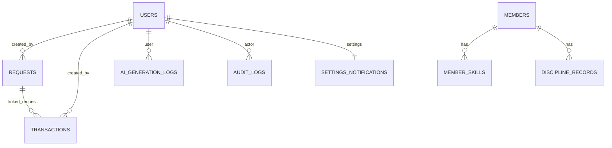

# BÁO CÁO CƠ SỞ DỮ LIỆU - MTEC Operations Hub (Backend)

Ngày cập nhật: 01/05/2026  
Phạm vi: `apps/backend`  
Nguồn phân tích: [models.py](file:///e:/Workspace/project/mtec-operations-hub/apps/backend/app/models.py), [migrations](file:///e:/Workspace/project/mtec-operations-hub/apps/backend/alembic/versions), [db.py](file:///e:/Workspace/project/mtec-operations-hub/apps/backend/app/db.py), [config.py](file:///e:/Workspace/project/mtec-operations-hub/apps/backend/app/core/config.py)

---

## 1. Tổng quan kỹ thuật

- ORM: SQLAlchemy 2.x (Declarative / `Mapped[]`)
- Migration: Alembic
- Driver Postgres: `psycopg` (psycopg3)
- CSDL hỗ trợ:
  - Local/dev mặc định: SQLite `sqlite:///./mtec_ops.db`
  - Production: PostgreSQL (có hỗ trợ normalize URL và Supabase `sslmode=require`)

### 1.1. Cấu hình kết nối

- Biến môi trường chính: `DATABASE_URL` (xem [config.py](file:///e:/Workspace/project/mtec-operations-hub/apps/backend/app/core/config.py#L32-L35))
- Chuẩn hoá URL:
  - `postgres://...` → `postgresql+psycopg://...`
  - `postgresql://...` → `postgresql+psycopg://...`
  - Nếu URL chứa `supabase.co` và chưa có `sslmode` → tự thêm `sslmode=require`

### 1.2. Chiến lược tạo schema

- Alembic cung cấp migration (xem [alembic/env.py](file:///e:/Workspace/project/mtec-operations-hub/apps/backend/alembic/env.py))
- Ngoài ra có cơ chế “auto-create tables” qua `Base.metadata.create_all()` khi `AUTO_CREATE_TABLES=true` (xem [main.py](file:///e:/Workspace/project/mtec-operations-hub/apps/backend/app/main.py#L68-L85))
  - Mặc định `AUTO_CREATE_TABLES` bật khi `APP_ENV=development`
  - Khuyến nghị: ở production nên tắt `AUTO_CREATE_TABLES` và chỉ dùng Alembic để tránh lệch schema

---

## 2. ERD (khái quát)

Ghi chú:
- `requests.linked_transaction_id` là “liên kết logic”, hiện chưa có ràng buộc FK ở DB.
- Các model hiện chỉ khai báo `ForeignKey` ở mức cột, chưa khai báo relationship() nên join chủ yếu thực hiện thủ công khi query.

---

## 3. Danh sách bảng & chi tiết schema

Quy ước:
- PK: Primary Key
- FK: Foreign Key
- Nullable: có thể NULL
- Default: giá trị mặc định (từ ORM)

### 3.1. `users`

Nguồn: [models.py](file:///e:/Workspace/project/mtec-operations-hub/apps/backend/app/models.py#L15-L31) / migration [001_initial](file:///e:/Workspace/project/mtec-operations-hub/apps/backend/alembic/versions/001_initial_migration.py#L24-L41)

| Cột | Kiểu | Nullable | Ràng buộc / Ghi chú |
|---|---|---:|---|
| id | String(36) | No | PK, default UUID v4 dạng string |
| username | String(50) | No | Unique, Index |
| password_hash | String(255) | No | Mật khẩu băm (bcrypt) |
| full_name | String(120) | No |  |
| role | String(30) | No | Index (RBAC) |
| avatar_initials | String(10) | Yes |  |
| email | String(120) | Yes |  |
| phone | String(30) | Yes |  |
| is_active | Boolean | No | Default `true` |
| created_at | DateTime | No | Default `datetime.now(UTC)` |
| updated_at | DateTime | No | Default & onupdate `datetime.now(UTC)` |

Chỉ mục:
- `ix_users_username` (unique)
- `ix_users_role`

### 3.2. `members`

Nguồn: [models.py](file:///e:/Workspace/project/mtec-operations-hub/apps/backend/app/models.py#L33-L57) / migration [001_initial](file:///e:/Workspace/project/mtec-operations-hub/apps/backend/alembic/versions/001_initial_migration.py#L42-L67)

| Cột | Kiểu | Nullable | Ràng buộc / Ghi chú |
|---|---|---:|---|
| id | String(36) | No | PK, default UUID v4 dạng string |
| mssv | String(20) | No | Unique, Index |
| name | String(120) | No |  |
| gender | String(20) | Yes |  |
| dob | Date | Yes |  |
| ban | String(50) | Yes |  |
| role_title | String(80) | Yes |  |
| status | String(20) | No | Default `Active` |
| phone | String(30) | Yes |  |
| email | String(120) | Yes |  |
| join_date | Date | Yes |  |
| lop | String(50) | Yes |  |
| chuyen_nganh | String(120) | Yes |  |
| khoa | String(120) | Yes |  |
| address | Text | Yes |  |
| experience | Text | Yes |  |
| goal | Text | Yes |  |
| orientation | Text | Yes |  |
| created_at | DateTime | No | Default `datetime.now(UTC)` |
| updated_at | DateTime | No | Default & onupdate `datetime.now(UTC)` |

Chỉ mục:
- `ix_members_mssv` (unique)

### 3.3. `member_skills`

Nguồn: [models.py](file:///e:/Workspace/project/mtec-operations-hub/apps/backend/app/models.py#L60-L70) / migration [001_initial](file:///e:/Workspace/project/mtec-operations-hub/apps/backend/alembic/versions/001_initial_migration.py#L158-L173)

| Cột | Kiểu | Nullable | Ràng buộc / Ghi chú |
|---|---|---:|---|
| id | String(36) | No | PK |
| member_id | String(36) | No | FK → `members.id`, Index |
| type | String(10) | No | Ví dụ: `hard` / `soft` |
| name | String(80) | No |  |
| level | String(20) | No |  |

Chỉ mục:
- `ix_member_skills_member_id`

### 3.4. `requests`

Nguồn: [models.py](file:///e:/Workspace/project/mtec-operations-hub/apps/backend/app/models.py#L72-L99) / migration [001_initial](file:///e:/Workspace/project/mtec-operations-hub/apps/backend/alembic/versions/001_initial_migration.py#L175-L211)

| Cột | Kiểu | Nullable | Ràng buộc / Ghi chú |
|---|---|---:|---|
| id | String(36) | No | PK |
| mssv | String(20) | No | Index |
| name | String(120) | No |  |
| type | String(60) | No | Index |
| date | Date | No |  |
| reason | Text | No |  |
| status | String(20) | No | Default `Cho duyet`, Index |
| reviewer | String(120) | Yes |  |
| reviewed_at | DateTime | Yes |  |
| review_note | Text | Yes |  |
| linked_transaction_id | String(36) | Yes | Liên kết logic, không có FK |
| finance_draft_enabled | Boolean | No | Default `false` |
| finance_draft_title | String(180) | Yes |  |
| finance_draft_amount | Float | Yes |  |
| finance_draft_type | String(10) | Yes |  |
| finance_draft_category | String(80) | Yes |  |
| created_by_user_id | String(36) | No | FK → `users.id`, Index |
| created_at | DateTime | No | Default `datetime.now(UTC)` |
| updated_at | DateTime | No | Default & onupdate `datetime.now(UTC)` |

Chỉ mục:
- `ix_requests_mssv`
- `ix_requests_type`
- `ix_requests_status`
- `ix_requests_created_by_user_id`

### 3.5. `transactions`

Nguồn: [models.py](file:///e:/Workspace/project/mtec-operations-hub/apps/backend/app/models.py#L102-L132) / migration [001_initial](file:///e:/Workspace/project/mtec-operations-hub/apps/backend/alembic/versions/001_initial_migration.py#L227-L278)

| Cột | Kiểu | Nullable | Ràng buộc / Ghi chú |
|---|---|---:|---|
| id | String(36) | No | PK |
| date | Date | No | Index |
| title | String(180) | No | Index |
| type | String(10) | No | Index (`Thu`/`Chi`) |
| amount | Float | No |  |
| owner | String(120) | No |  |
| category | String(80) | No | Index |
| status | String(20) | No | Index (`Cho duyet`/`Da duyet`/`Tu choi`) |
| required_approval_role | String(30) | Yes |  |
| reviewer | String(120) | Yes |  |
| reviewed_at | DateTime | Yes |  |
| approval_note | Text | Yes |  |
| linked_request_id | String(36) | Yes | FK → `requests.id` |
| linked_request_type | String(60) | Yes | Dư thừa theo nghiệp vụ (denormalized) |
| is_deleted | Boolean | No | Default `false`, Index (soft delete) |
| deleted_at | DateTime | Yes | Metadata soft delete |
| deleted_by | String(120) | Yes | Metadata soft delete |
| created_by_user_id | String(36) | No | FK → `users.id`, Index |
| created_at | DateTime | No | Default `datetime.now(UTC)` |
| updated_at | DateTime | No | Default & onupdate `datetime.now(UTC)` |

Chỉ mục:
- `ix_transactions_date`
- `ix_transactions_title`
- `ix_transactions_type`
- `ix_transactions_category`
- `ix_transactions_status`
- `ix_transactions_is_deleted`
- `ix_transactions_created_by_user_id`

### 3.6. `assets`

Nguồn: [models.py](file:///e:/Workspace/project/mtec-operations-hub/apps/backend/app/models.py#L135-L147) / migration [001_initial](file:///e:/Workspace/project/mtec-operations-hub/apps/backend/alembic/versions/001_initial_migration.py#L68-L82)

| Cột | Kiểu | Nullable | Ràng buộc / Ghi chú |
|---|---|---:|---|
| id | String(36) | No | PK |
| name | String(120) | No | Index |
| quantity | Integer | No |  |
| status | String(30) | No | Index |
| holder | String(120) | Yes |  |
| category | String(80) | Yes |  |
| created_at | DateTime | No | Default `datetime.now(UTC)` |
| updated_at | DateTime | No | Default & onupdate `datetime.now(UTC)` |

Chỉ mục:
- `ix_assets_name`
- `ix_assets_status`

### 3.7. `discipline_records`

Nguồn: [models.py](file:///e:/Workspace/project/mtec-operations-hub/apps/backend/app/models.py#L150-L167) / migration [001_initial](file:///e:/Workspace/project/mtec-operations-hub/apps/backend/alembic/versions/001_initial_migration.py#L135-L157)

| Cột | Kiểu | Nullable | Ràng buộc / Ghi chú |
|---|---|---:|---|
| id | String(36) | No | PK |
| member_id | String(36) | Yes | FK → `members.id` |
| mssv | String(20) | No | Index |
| name | String(120) | No |  |
| committee | String(120) | Yes |  |
| absents | Integer | No | Default `0` |
| kpi | Float | No | Default `0` |
| discipline_level | String(40) | No | Default `Khong` |
| note | Text | Yes |  |
| updated_by | String(120) | Yes |  |
| updated_at | DateTime | No | Default & onupdate `datetime.now(UTC)` |

Chỉ mục:
- `ix_discipline_records_mssv`

### 3.8. `settings_notifications`

Nguồn: [models.py](file:///e:/Workspace/project/mtec-operations-hub/apps/backend/app/models.py#L170-L182) / migration [001_initial](file:///e:/Workspace/project/mtec-operations-hub/apps/backend/alembic/versions/001_initial_migration.py#L212-L226)

| Cột | Kiểu | Nullable | Ràng buộc / Ghi chú |
|---|---|---:|---|
| user_id | String(36) | No | PK, FK → `users.id` (1-1 theo user) |
| noti1 | Boolean | No | Default `true` |
| noti2 | Boolean | No | Default `true` |
| noti3 | Boolean | No | Default `true` |
| noti4 | Boolean | No | Default `true` |
| updated_at | DateTime | No | Default & onupdate `datetime.now(UTC)` |

### 3.9. `ai_generation_logs`

Nguồn: [models.py](file:///e:/Workspace/project/mtec-operations-hub/apps/backend/app/models.py#L185-L196) / migration [001_initial](file:///e:/Workspace/project/mtec-operations-hub/apps/backend/alembic/versions/001_initial_migration.py#L83-L105)

| Cột | Kiểu | Nullable | Ràng buộc / Ghi chú |
|---|---|---:|---|
| id | String(36) | No | PK |
| user_id | String(36) | No | FK → `users.id`, Index |
| module | String(30) | No |  |
| prompt | Text | No |  |
| response_text | Text | Yes |  |
| provider | String(30) | No | Default `gemini` |
| status | String(20) | No | Default `success` |
| created_at | DateTime | No | Default `datetime.now(UTC)` |

Chỉ mục:
- `ix_ai_generation_logs_user_id`

### 3.10. `audit_logs`

Nguồn: [models.py](file:///e:/Workspace/project/mtec-operations-hub/apps/backend/app/models.py#L198-L210) / migration [001_initial](file:///e:/Workspace/project/mtec-operations-hub/apps/backend/alembic/versions/001_initial_migration.py#L106-L134)

| Cột | Kiểu | Nullable | Ràng buộc / Ghi chú |
|---|---|---:|---|
| id | String(36) | No | PK |
| actor_user_id | String(36) | Yes | FK → `users.id` |
| action | String(60) | No | Index |
| resource_type | String(40) | No | Index |
| resource_id | String(36) | No | Index |
| before_snapshot | Text | Yes |  |
| after_snapshot | Text | Yes |  |
| created_at | DateTime | No | Default `datetime.now(UTC)` |

Chỉ mục:
- `ix_audit_logs_action`
- `ix_audit_logs_resource_type`
- `ix_audit_logs_resource_id`

---

## 4. Migration hiện có

Thư mục: [alembic/versions](file:///e:/Workspace/project/mtec-operations-hub/apps/backend/alembic/versions)

- `001_initial` (2024-04-28): tạo toàn bộ bảng và chỉ mục nền tảng
- `12d5e4a624e9` (2026-04-29): file migration được tạo nhưng `upgrade()`/`downgrade()` đang `pass` (không áp dụng thay đổi)

---

## 5. Ghi chú nghiệp vụ ảnh hưởng thiết kế DB

- Request/Transaction dùng trạng thái dạng string:
  - `Cho duyet` → chờ duyệt
  - `Da duyet` → đã duyệt
  - `Tu choi` → từ chối
- Transaction có soft delete:
  - `is_deleted=true` + `deleted_at` + `deleted_by`
- `settings_notifications` thiết kế 1-1 theo `users` (PK chính là `user_id`)

---

## 6. Nhận xét & rủi ro kỹ thuật (để theo dõi)

- `requests.linked_transaction_id` chưa có FK → có thể phát sinh dữ liệu “mồ côi” hoặc trỏ sai giao dịch nếu update thủ công.
- Migration `12d5e4a624e9` hiện không làm gì → nếu mục tiêu là bổ sung FK/constraint, cần cập nhật lại migration để phản ánh đúng schema mong muốn.
- Cơ chế `AUTO_CREATE_TABLES` có thể làm lệch schema so với Alembic nếu dùng song song trong cùng môi trường (đặc biệt production).
