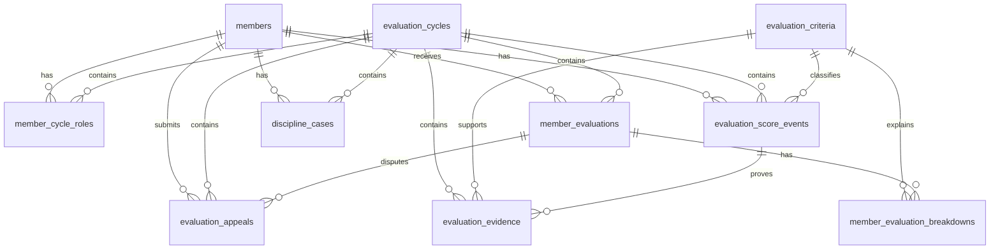

# Phase 1 Implementation Guide - Evaluation Schema & Migration

## 1. Mục tiêu Phase 1

Phase 1 tập trung xây nền dữ liệu cho module `evaluations` để thay thế dần module Discipline legacy. Phạm vi chính là thiết kế model, migration Alembic, index, constraint và bộ kiểm tra schema tối thiểu.

Phase này chưa triển khai đầy đủ API tính điểm, workflow đối soát hoặc giao diện frontend. Các phần đó thuộc Phase 2 trở đi.

## 2. Phạm vi thực hiện

### 2.1. Trong phạm vi

| Hạng mục | Mục tiêu |
|---|---|
| Data model | Bổ sung các bảng lõi cho kỳ đánh giá, tiêu chí, điểm, minh chứng, kết quả tổng hợp, vai trò đa ban, đối soát và hồ sơ kỷ luật. |
| Alembic migration | Tạo migration mới, không phá dữ liệu cũ. |
| Index & constraint | Bổ sung index phục vụ truy vấn theo kỳ, thành viên, tiêu chí, đơn vị và trạng thái. |
| Legacy compatibility | Giữ nguyên `discipline_records` và API v1 hiện tại. |
| Seed readiness | Chuẩn bị schema để Phase 2/3 có thể seed tiêu chí từ quy chế. |
| Test tối thiểu | Kiểm tra migration chạy lên/xuống, bảng tồn tại, constraint cơ bản hoạt động. |

### 2.2. Ngoài phạm vi

| Hạng mục | Lý do |
|---|---|
| API `/api/v2/evaluations` hoàn chỉnh | Thuộc Phase 3. |
| Service tính điểm | Thuộc Phase 2. |
| Workflow đối soát đầy đủ | Thuộc Phase 4. |
| Migration dữ liệu legacy | Thuộc Phase 5. |
| Export báo cáo | Thuộc Phase sau khi kết quả đánh giá ổn định. |
| Refactor toàn bộ `app/models.py` thành package | Không nên làm đồng thời để tránh tăng rủi ro. |

## 3. Nguyên tắc thiết kế

1. Không sửa phá vỡ bảng `discipline_records` hiện tại.
2. Không đổi response của API v1 trong Phase 1.
3. Không dùng DB Enum cứng để tránh khó khăn khi chạy đồng thời SQLite và PostgreSQL.
4. Các trạng thái dùng `String` và được validate ở tầng application/service.
5. JSON metadata nên lưu bằng `Text` chứa JSON string để tương thích stack hiện tại.
6. Mọi bảng nghiệp vụ chính phải có `created_at` và `updated_at` nếu có khả năng bị chỉnh sửa.
7. Kết quả tổng hợp phải có thể tái tính từ score events và evidence.
8. Không hard-code bộ tiêu chí trong migration; migration chỉ tạo schema.
9. Seed tiêu chí được tách thành file seed riêng ở Phase 2/3.
10. Mọi thao tác làm thay đổi điểm sau này phải ghi được audit log.

## 4. Quy ước trạng thái và mã hóa

### 4.1. Evaluation cycle status

```text
DRAFT
DATA_COLLECTION
MEMBER_REVIEW
APPROVED
LOCKED
CANCELLED
```

### 4.2. Evaluation type

```text
MONTHLY
QUARTERLY
TERM
EVENT
AD_HOC
```

### 4.3. Component code

```text
I
II
III_A
III_B
```

### 4.4. Unit code

```text
BCN
BCNg
BTT
BVH_NS
BVH_KL
BVH_HC
BVH_TC
ALL
```

### 4.5. Score event type

```text
BASE
BONUS
PENALTY
MANUAL_SCORE
OVERRIDE
OBSERVATION
LEGACY_IMPORT
```

### 4.6. Evidence type

```text
LINK
FILE
TASK
GITHUB
GOOGLE_SHEET
GOOGLE_FORM
MEETING_MINUTES
MESSAGE
EMAIL
SYSTEM_LOG
OTHER
```

### 4.7. Classification

```text
EXCELLENT
GOOD
PASSED
NEEDS_IMPROVEMENT
FAILED
```

Các label tiếng Việt sẽ được xử lý ở tầng response/UI:

| Code | Label |
|---|---|
| `EXCELLENT` | Xuất sắc |
| `GOOD` | Tốt |
| `PASSED` | Đạt |
| `NEEDS_IMPROVEMENT` | Cần cải thiện |
| `FAILED` | Không đạt |

## 5. ERD mục tiêu



## 6. Bảng dữ liệu cần tạo

## 6.1. `evaluation_cycles`

Lưu kỳ đánh giá.

| Column | Type | Null | Ghi chú |
|---|---|---:|---|
| `id` | `String(36)` | No | UUID primary key. |
| `code` | `String(50)` | No | Mã kỳ, ví dụ `2026-05-MONTHLY`. Unique. |
| `name` | `String(180)` | No | Tên kỳ đánh giá. |
| `type` | `String(30)` | No | `MONTHLY`, `QUARTERLY`, `TERM`, `EVENT`, `AD_HOC`. |
| `start_date` | `Date` | No | Ngày bắt đầu kỳ. |
| `end_date` | `Date` | No | Ngày kết thúc kỳ. |
| `status` | `String(30)` | No | Mặc định `DRAFT`. |
| `description` | `Text` | Yes | Ghi chú. |
| `created_by_user_id` | `String(36)` | Yes | FK `users.id`. |
| `approved_by_user_id` | `String(36)` | Yes | FK `users.id`. |
| `approved_at` | `DateTime` | Yes | Thời điểm duyệt. |
| `locked_at` | `DateTime` | Yes | Thời điểm khóa. |
| `metadata_json` | `Text` | Yes | JSON mở rộng. |
| `created_at` | `DateTime` | No | Mặc định UTC now. |
| `updated_at` | `DateTime` | No | Auto update. |

Index/constraint:

- Unique: `code`.
- Index: `status`, `type`, `start_date`, `end_date`.

## 6.2. `evaluation_criteria`

Lưu bộ tiêu chí đánh giá.

| Column | Type | Null | Ghi chú |
|---|---|---:|---|
| `id` | `String(36)` | No | UUID primary key. |
| `code` | `String(50)` | No | Ví dụ `I.1`, `II.4`, `III-A.2`, `III-B.BCNg.01`. |
| `name` | `String(255)` | No | Tên tiêu chí. |
| `component` | `String(20)` | No | `I`, `II`, `III_A`, `III_B`. |
| `unit_scope` | `String(30)` | No | `ALL` hoặc `UNIT_SPECIFIC`. |
| `unit_code` | `String(30)` | Yes | Áp dụng cho Ban/Tổ nào, nullable nếu dùng chung. |
| `max_score` | `Float` | No | Điểm tối đa. |
| `score_method` | `String(30)` | No | `RATIO`, `DEDUCTIVE`, `ADDITIVE`, `MANUAL`, `WEIGHTED`. |
| `requires_evidence` | `Boolean` | No | Mặc định `True`. |
| `is_active` | `Boolean` | No | Mặc định `True`. |
| `sort_order` | `Integer` | No | Thứ tự hiển thị. |
| `effective_from` | `Date` | Yes | Ngày hiệu lực. |
| `effective_to` | `Date` | Yes | Ngày hết hiệu lực. |
| `description` | `Text` | Yes | Diễn giải tiêu chí. |
| `metadata_json` | `Text` | Yes | Cấu hình chi tiết: công thức, mức trừ, ghi chú. |
| `created_at` | `DateTime` | No | Mặc định UTC now. |
| `updated_at` | `DateTime` | No | Auto update. |

Index/constraint:

- Unique đề xuất: `code`, `unit_code`, `effective_from`.
- Index: `component`, `unit_code`, `is_active`.

## 6.3. `evaluation_score_events`

Lưu từng sự kiện ghi nhận điểm, điểm trừ, điểm cộng hoặc dữ liệu đầu vào.

| Column | Type | Null | Ghi chú |
|---|---|---:|---|
| `id` | `String(36)` | No | UUID primary key. |
| `cycle_id` | `String(36)` | No | FK `evaluation_cycles.id`. |
| `member_id` | `String(36)` | No | FK `members.id`. |
| `criterion_id` | `String(36)` | No | FK `evaluation_criteria.id`. |
| `criterion_code` | `String(50)` | No | Snapshot mã tiêu chí để giữ lịch sử. |
| `component` | `String(20)` | No | Snapshot component. |
| `unit_code` | `String(30)` | Yes | Ban/Tổ liên quan. |
| `event_type` | `String(30)` | No | `BASE`, `BONUS`, `PENALTY`, `MANUAL_SCORE`, ... |
| `source_type` | `String(50)` | Yes | `ATTENDANCE`, `REQUEST`, `TASK`, `COMPETITION`, `MANUAL`, ... |
| `source_id` | `String(80)` | Yes | ID nguồn nếu có. |
| `raw_value` | `Float` | Yes | Giá trị đầu vào, ví dụ số buổi tham gia. |
| `score_delta` | `Float` | No | Điểm cộng/trừ hoặc điểm ghi nhận. |
| `max_score_snapshot` | `Float` | Yes | Snapshot điểm tối đa tiêu chí. |
| `weight` | `Float` | Yes | Dùng cho đa ban hoặc weighted score. |
| `note` | `Text` | Yes | Ghi chú. |
| `recorded_by_user_id` | `String(36)` | Yes | FK `users.id`. |
| `recorded_at` | `DateTime` | No | Thời điểm ghi nhận. |
| `is_void` | `Boolean` | No | Mặc định `False`, dùng để hủy event mà không xóa. |
| `void_reason` | `Text` | Yes | Lý do hủy. |
| `metadata_json` | `Text` | Yes | JSON mở rộng. |
| `created_at` | `DateTime` | No | Mặc định UTC now. |
| `updated_at` | `DateTime` | No | Auto update. |

Index/constraint:

- Index: `cycle_id`, `member_id`, `criterion_id`, `criterion_code`, `component`, `unit_code`, `event_type`, `source_type`, `source_id`, `is_void`.
- Unique chống sync lặp nếu có nguồn: `cycle_id`, `member_id`, `criterion_code`, `source_type`, `source_id`, `event_type`.

Ghi chú: SQLite cho phép nhiều `NULL` trong unique constraint. Nếu `source_id` nullable, logic chống trùng với manual event phải xử lý ở service.

## 6.4. `evaluation_evidence`

Lưu minh chứng cho score event hoặc cho kết quả đánh giá.

| Column | Type | Null | Ghi chú |
|---|---|---:|---|
| `id` | `String(36)` | No | UUID primary key. |
| `cycle_id` | `String(36)` | No | FK `evaluation_cycles.id`. |
| `member_id` | `String(36)` | No | FK `members.id`. |
| `criterion_id` | `String(36)` | Yes | FK `evaluation_criteria.id`. |
| `score_event_id` | `String(36)` | Yes | FK `evaluation_score_events.id`. |
| `evidence_type` | `String(30)` | No | `LINK`, `FILE`, `TASK`, `GITHUB`, ... |
| `title` | `String(255)` | No | Tên minh chứng. |
| `url` | `String(1000)` | Yes | Link minh chứng. |
| `file_path` | `String(500)` | Yes | Đường dẫn nội bộ nếu có file upload. |
| `description` | `Text` | Yes | Mô tả. |
| `captured_at` | `DateTime` | Yes | Thời điểm phát sinh minh chứng. |
| `submitted_by_user_id` | `String(36)` | Yes | FK `users.id`. |
| `verified_by_user_id` | `String(36)` | Yes | FK `users.id`. |
| `verified_at` | `DateTime` | Yes | Thời điểm xác minh. |
| `status` | `String(30)` | No | `PENDING`, `VERIFIED`, `REJECTED`. |
| `metadata_json` | `Text` | Yes | JSON mở rộng. |
| `created_at` | `DateTime` | No | Mặc định UTC now. |
| `updated_at` | `DateTime` | No | Auto update. |

Index:

- `cycle_id`, `member_id`, `criterion_id`, `score_event_id`, `evidence_type`, `status`.

## 6.5. `member_evaluations`

Lưu kết quả tổng hợp của một thành viên trong một kỳ.

| Column | Type | Null | Ghi chú |
|---|---|---:|---|
| `id` | `String(36)` | No | UUID primary key. |
| `cycle_id` | `String(36)` | No | FK `evaluation_cycles.id`. |
| `member_id` | `String(36)` | No | FK `members.id`. |
| `component_i_score` | `Float` | No | 0-30. |
| `component_ii_score` | `Float` | No | 0-20. |
| `component_iii_a_score` | `Float` | No | 0-30. |
| `component_iii_b_score` | `Float` | No | 0-20. |
| `total_score` | `Float` | No | 0-100. |
| `preliminary_classification` | `String(40)` | Yes | Xếp loại trước blocker. |
| `final_classification` | `String(40)` | Yes | Xếp loại sau blocker. |
| `status` | `String(30)` | No | `DRAFT`, `COMPUTED`, `MEMBER_REVIEW`, `APPEALED`, `APPROVED`, `LOCKED`. |
| `attendance_rate` | `Float` | Yes | Tỷ lệ chuyên cần. |
| `blockers_json` | `Text` | Yes | Danh sách điều kiện chặn. |
| `calculation_version` | `String(50)` | Yes | Version công thức. |
| `computed_at` | `DateTime` | Yes | Thời điểm tính. |
| `approved_by_user_id` | `String(36)` | Yes | FK `users.id`. |
| `approved_at` | `DateTime` | Yes | Thời điểm duyệt. |
| `metadata_json` | `Text` | Yes | JSON mở rộng. |
| `created_at` | `DateTime` | No | Mặc định UTC now. |
| `updated_at` | `DateTime` | No | Auto update. |

Index/constraint:

- Unique: `cycle_id`, `member_id`.
- Index: `cycle_id`, `member_id`, `status`, `final_classification`, `total_score`.

## 6.6. `member_evaluation_breakdowns`

Lưu breakdown theo từng tiêu chí để giải trình điểm.

| Column | Type | Null | Ghi chú |
|---|---|---:|---|
| `id` | `String(36)` | No | UUID primary key. |
| `member_evaluation_id` | `String(36)` | No | FK `member_evaluations.id`. |
| `cycle_id` | `String(36)` | No | FK `evaluation_cycles.id`. |
| `member_id` | `String(36)` | No | FK `members.id`. |
| `criterion_id` | `String(36)` | No | FK `evaluation_criteria.id`. |
| `criterion_code` | `String(50)` | No | Snapshot mã tiêu chí. |
| `component` | `String(20)` | No | `I`, `II`, `III_A`, `III_B`. |
| `unit_code` | `String(30)` | Yes | Ban/Tổ liên quan. |
| `raw_score` | `Float` | No | Điểm trước cap. |
| `final_score` | `Float` | No | Điểm sau cap. |
| `max_score_snapshot` | `Float` | No | Điểm tối đa tại thời điểm tính. |
| `cap_applied` | `Boolean` | No | Có bị chặn trần không. |
| `evidence_count` | `Integer` | No | Số minh chứng liên quan. |
| `calculation_note` | `Text` | Yes | Ghi chú công thức. |
| `metadata_json` | `Text` | Yes | JSON mở rộng. |
| `created_at` | `DateTime` | No | Mặc định UTC now. |
| `updated_at` | `DateTime` | No | Auto update. |

Index/constraint:

- Unique: `member_evaluation_id`, `criterion_code`, `unit_code`.
- Index: `cycle_id`, `member_id`, `criterion_id`, `criterion_code`, `component`, `unit_code`.

## 6.7. `member_cycle_roles`

Lưu vai trò và trọng số tham gia của thành viên trong kỳ, phục vụ tính đa ban.

| Column | Type | Null | Ghi chú |
|---|---|---:|---|
| `id` | `String(36)` | No | UUID primary key. |
| `cycle_id` | `String(36)` | No | FK `evaluation_cycles.id`. |
| `member_id` | `String(36)` | No | FK `members.id`. |
| `unit_code` | `String(30)` | No | Ban/Tổ. |
| `role_type` | `String(30)` | No | `PRIMARY`, `SECONDARY`, `SHORT_TERM`, `SPECIAL`. |
| `role_title` | `String(120)` | Yes | Chức danh/vai trò. |
| `participation_weight` | `Float` | No | 0.0-1.0. |
| `is_primary` | `Boolean` | No | Có phải Ban chính không. |
| `assigned_by_user_id` | `String(36)` | Yes | FK `users.id`. |
| `approved_by_user_id` | `String(36)` | Yes | FK `users.id`. |
| `approved_at` | `DateTime` | Yes | Thời điểm duyệt trọng số. |
| `note` | `Text` | Yes | Ghi chú. |
| `metadata_json` | `Text` | Yes | JSON mở rộng. |
| `created_at` | `DateTime` | No | Mặc định UTC now. |
| `updated_at` | `DateTime` | No | Auto update. |

Index/constraint:

- Unique: `cycle_id`, `member_id`, `unit_code`.
- Index: `cycle_id`, `member_id`, `unit_code`, `role_type`, `is_primary`.

Ràng buộc kiểm tra tổng trọng số bằng 1.0 nên đặt ở service, không đặt DB constraint vì cần aggregate theo member/cycle.

## 6.8. `evaluation_appeals`

Lưu yêu cầu đối soát. Phase 1 chỉ tạo schema, workflow xử lý thuộc Phase 4.

| Column | Type | Null | Ghi chú |
|---|---|---:|---|
| `id` | `String(36)` | No | UUID primary key. |
| `cycle_id` | `String(36)` | No | FK `evaluation_cycles.id`. |
| `member_id` | `String(36)` | No | FK `members.id`. |
| `member_evaluation_id` | `String(36)` | Yes | FK `member_evaluations.id`. |
| `criterion_id` | `String(36)` | Yes | FK `evaluation_criteria.id`. |
| `criterion_code` | `String(50)` | Yes | Mã tiêu chí bị khiếu nại. |
| `appeal_type` | `String(50)` | No | `SCORE`, `EVIDENCE`, `ATTENDANCE`, `CLASSIFICATION`, `OTHER`. |
| `content` | `Text` | No | Nội dung đối soát. |
| `requested_score` | `Float` | Yes | Điểm mong muốn nếu có. |
| `status` | `String(30)` | No | `PENDING`, `IN_REVIEW`, `ACCEPTED`, `REJECTED`, `CANCELLED`. |
| `resolved_by_user_id` | `String(36)` | Yes | FK `users.id`. |
| `resolved_at` | `DateTime` | Yes | Thời điểm xử lý. |
| `resolution_note` | `Text` | Yes | Kết quả xử lý. |
| `metadata_json` | `Text` | Yes | JSON mở rộng. |
| `created_at` | `DateTime` | No | Mặc định UTC now. |
| `updated_at` | `DateTime` | No | Auto update. |

Index:

- `cycle_id`, `member_id`, `member_evaluation_id`, `criterion_id`, `status`, `appeal_type`.

## 6.9. `discipline_cases`

Lưu hồ sơ kỷ luật riêng, không trộn với điểm tổng hợp.

| Column | Type | Null | Ghi chú |
|---|---|---:|---|
| `id` | `String(36)` | No | UUID primary key. |
| `cycle_id` | `String(36)` | Yes | FK `evaluation_cycles.id`. Nullable nếu vụ việc ngoài kỳ. |
| `member_id` | `String(36)` | No | FK `members.id`. |
| `case_code` | `String(80)` | Yes | Mã hồ sơ. |
| `case_type` | `String(50)` | No | `REMINDER`, `WARNING`, `SUSPENSION`, `EXPULSION_REVIEW`, ... |
| `severity` | `String(30)` | No | `LOW`, `MEDIUM`, `HIGH`, `CRITICAL`. |
| `status` | `String(30)` | No | `OPEN`, `RESOLVED`, `CANCELLED`. |
| `title` | `String(255)` | No | Tiêu đề vụ việc. |
| `description` | `Text` | Yes | Mô tả. |
| `blocker_code` | `String(80)` | Yes | Điều kiện chặn xếp loại nếu có. |
| `point_impact` | `Float` | Yes | Điểm ảnh hưởng nếu có. |
| `source_type` | `String(50)` | Yes | Nguồn phát sinh. |
| `source_id` | `String(80)` | Yes | ID nguồn. |
| `created_by_user_id` | `String(36)` | Yes | FK `users.id`. |
| `resolved_by_user_id` | `String(36)` | Yes | FK `users.id`. |
| `resolved_at` | `DateTime` | Yes | Thời điểm xử lý xong. |
| `resolution_note` | `Text` | Yes | Ghi chú xử lý. |
| `metadata_json` | `Text` | Yes | JSON mở rộng. |
| `created_at` | `DateTime` | No | Mặc định UTC now. |
| `updated_at` | `DateTime` | No | Auto update. |

Index/constraint:

- Unique nullable đề xuất: `case_code` nếu có.
- Index: `cycle_id`, `member_id`, `case_type`, `severity`, `status`, `blocker_code`.

## 7. File cần thay đổi trong Phase 1

```text
app/models.py
alembic/versions/<new_revision>_add_evaluation_core_tables.py
tests/test_evaluation_schema.py
docs/discipline/PHASE_1_SCHEMA_MIGRATION.md
```

Ghi chú:

- Không tạo `app/models/` package trong Phase 1 vì hiện repo đang dùng `app/models.py`. Việc đổi sang package có thể phá import hiện tại.
- Nếu cần giảm kích thước `models.py`, việc refactor nên tách thành một phase riêng.

## 8. SQLAlchemy model outline

Đoạn dưới là outline, không phải code cuối cùng bắt buộc copy nguyên văn.

```python
class EvaluationCycle(Base):
    __tablename__ = "evaluation_cycles"

    id = mapped_column(String(36), primary_key=True, default=_uuid)
    code = mapped_column(String(50), unique=True, index=True)
    name = mapped_column(String(180))
    type = mapped_column(String(30), index=True)
    start_date = mapped_column(Date, index=True)
    end_date = mapped_column(Date, index=True)
    status = mapped_column(String(30), default="DRAFT", index=True)
    description = mapped_column(Text, nullable=True)
    created_by_user_id = mapped_column(String(36), ForeignKey("users.id"), nullable=True)
    approved_by_user_id = mapped_column(String(36), ForeignKey("users.id"), nullable=True)
    approved_at = mapped_column(DateTime, nullable=True)
    locked_at = mapped_column(DateTime, nullable=True)
    metadata_json = mapped_column(Text, nullable=True)
    created_at = mapped_column(DateTime, default=datetime.now(UTC))
    updated_at = mapped_column(DateTime, default=datetime.now(UTC), onupdate=datetime.now(UTC))
```

Các model còn lại triển khai theo bảng mô tả ở mục 6.

## 9. Alembic migration outline

Tên migration đề xuất:

```text
alembic/versions/d2a1f7e9b001_add_evaluation_core_tables.py
```

`down_revision` cần trỏ về migration head hiện tại. Tại thời điểm lập tài liệu, migration gần nhất đã xác định trong repo là:

```text
c4f2b5f0a2b1_add_activity_tables.py
```

Skeleton:

```python
"""add_evaluation_core_tables

Revision ID: d2a1f7e9b001
Revises: c4f2b5f0a2b1
Create Date: 2026-05-21 00:00:00.000000
"""

from typing import Sequence, Union

import sqlalchemy as sa
from alembic import op

revision: str = "d2a1f7e9b001"
down_revision: Union[str, None] = "c4f2b5f0a2b1"
branch_labels: Union[str, Sequence[str], None] = None
depends_on: Union[str, Sequence[str], None] = None


def upgrade() -> None:
    op.create_table(...)
    op.create_index(...)


def downgrade() -> None:
    op.drop_index(...)
    op.drop_table(...)
```

Thứ tự tạo bảng trong `upgrade()`:

1. `evaluation_cycles`
2. `evaluation_criteria`
3. `member_cycle_roles`
4. `evaluation_score_events`
5. `evaluation_evidence`
6. `member_evaluations`
7. `member_evaluation_breakdowns`
8. `evaluation_appeals`
9. `discipline_cases`

Thứ tự xóa bảng trong `downgrade()` là chiều ngược lại.

## 10. Ràng buộc kỹ thuật cần lưu ý

### 10.1. Không dùng DB Enum

Sử dụng `String` để giữ tương thích SQLite/PostgreSQL. Validation dùng Pydantic hoặc service layer.

### 10.2. Không xóa hard delete event điểm

`evaluation_score_events` dùng `is_void` để hủy event. Không xóa trực tiếp để giữ auditability.

### 10.3. Chống cộng trùng attendance

Phase 1 chỉ tạo unique constraint/index hỗ trợ. Logic idempotency nằm ở Phase 2.

Đề xuất constraint:

```text
cycle_id + member_id + criterion_code + source_type + source_id + event_type
```

### 10.4. Tổng trọng số đa ban

Không đặt DB constraint cho tổng trọng số bằng 1.0. Kiểm tra này cần service vì phải aggregate theo `cycle_id + member_id`.

### 10.5. Giữ snapshot mã tiêu chí

`evaluation_score_events` và `member_evaluation_breakdowns` đều lưu `criterion_code` để bảo toàn lịch sử nếu bảng tiêu chí thay đổi tên hoặc cấu hình.

## 11. Checklist triển khai

### 11.1. Model

- [x] Thêm import cần thiết trong `app/models.py` nếu thiếu: `UniqueConstraint`, `Index`.
- [x] Thêm class `EvaluationCycle`.
- [x] Thêm class `EvaluationCriterion`.
- [x] Thêm class `EvaluationScoreEvent`.
- [x] Thêm class `EvaluationEvidence`.
- [x] Thêm class `MemberEvaluation`.
- [x] Thêm class `MemberEvaluationBreakdown`.
- [x] Thêm class `MemberCycleRole`.
- [x] Thêm class `EvaluationAppeal`.
- [x] Thêm class `DisciplineCase`.
- [x] Kiểm tra import quan hệ với `Member`, `User` không tạo circular error.

### 11.2. Migration

- [x] Tạo revision Alembic mới.
- [x] Tạo bảng đúng thứ tự FK.
- [x] Tạo index cho các cột truy vấn chính.
- [x] Tạo unique constraint cần thiết.
- [x] Viết downgrade theo thứ tự ngược.
- [x] Chạy `alembic upgrade head` trên database rỗng.
- [x] Chạy `alembic downgrade -1` để kiểm tra rollback.
- [x] Chạy lại `alembic upgrade head` sau rollback.

### 11.3. Test

- [x] Test migration tạo đủ bảng.
- [x] Test unique `evaluation_cycles.code`.
- [x] Test unique `member_evaluations(cycle_id, member_id)`.
- [x] Test FK cơ bản tới `members`, `users`, `evaluation_cycles`, `evaluation_criteria`.
- [x] Test insert một cycle, một criterion, một member role, một score event, một evidence.
- [x] Test rollback migration nếu môi trường CI cho phép.

## 12. Test case tối thiểu

File đề xuất:

```text
tests/test_evaluation_schema.py
```

Các test cần có:

```python
def test_create_evaluation_cycle(db):
    ...


def test_cycle_code_unique(db):
    ...


def test_create_criterion(db):
    ...


def test_member_evaluation_unique_per_cycle_member(db):
    ...


def test_score_event_can_attach_evidence(db):
    ...
```

Mục tiêu của Phase 1 test là xác nhận schema và constraint, chưa kiểm tra thuật toán tính điểm.

## 13. Kế hoạch kiểm thử thủ công

Sau khi code Phase 1:

```bash
alembic upgrade head
pytest tests/test_evaluation_schema.py
ruff check .
```

Nếu dự án đang bật `AUTO_CREATE_TABLES`, vẫn cần kiểm tra Alembic riêng vì production nên dựa trên migration, không dựa trên `Base.metadata.create_all()`.

## 14. Tiêu chí hoàn thành Phase 1

Phase 1 hoàn thành khi:

- Có migration mới tạo đầy đủ bảng evaluation core.
- `alembic upgrade head` chạy thành công.
- `alembic downgrade -1` chạy thành công trong môi trường dev/test.
- App start không lỗi import model.
- API v1 hiện tại không bị thay đổi response.
- `discipline_records` vẫn tồn tại và chưa bị thay đổi destructive.
- Có test schema tối thiểu.
- Có tài liệu schema/migration để Phase 2 dùng làm đầu vào.

## 15. Rủi ro và biện pháp kiểm soát

| Rủi ro | Mức độ | Biện pháp |
|---|---:|---|
| Lệch migration head | Trung bình | Xác định lại `alembic heads` trước khi tạo revision. |
| Import model lỗi do forward reference | Trung bình | Giữ model trong `app/models.py`, không refactor package ở Phase 1. |
| Constraint quá chặt làm khó nhập dữ liệu thực tế | Trung bình | Chỉ đặt unique cho các quan hệ chắc chắn; các rule nghiệp vụ phức tạp đưa vào service. |
| SQLite/PostgreSQL khác biệt hành vi JSON/Enum | Cao | Dùng `String` và `Text` JSON. |
| Gãy frontend do API v1 thay đổi | Cao | Không sửa router v1 trong Phase 1. |
| Dữ liệu legacy bị ảnh hưởng | Cao | Không migrate hoặc delete dữ liệu legacy trong Phase 1. |

## 16. Ghi chú cho Phase 2

Sau Phase 1, Phase 2 cần triển khai:

- `EvaluationCalculatorService`.
- `ClassificationPolicyService`.
- `EvidenceValidationService`.
- Seed tiêu chí từ quy chế.
- Logic cap điểm theo tiêu chí/cấu phần.
- Logic blocker xếp loại.
- Logic idempotency cho attendance sync.
- Unit test thuật toán tính điểm.
