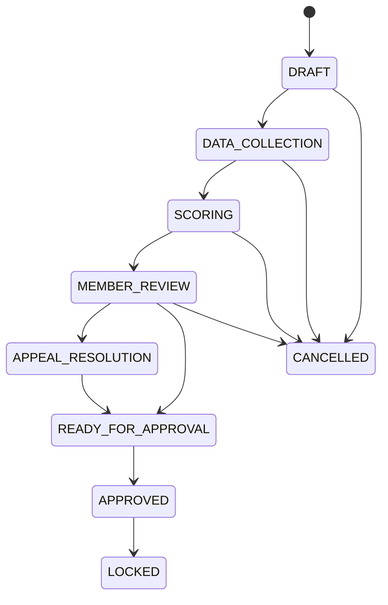
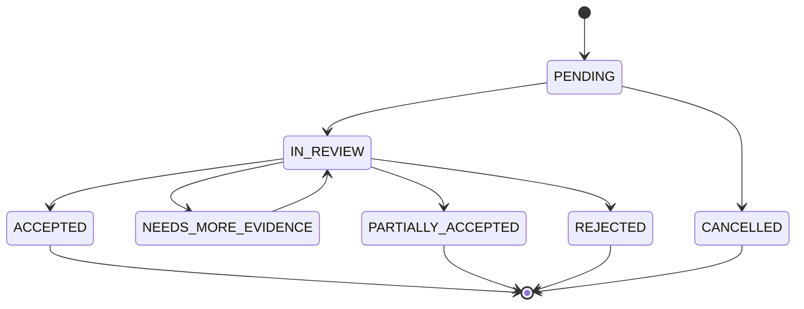

# Phase 4 Implementation Guide - Review, Appeal, Approval & Lock Workflow

## 1. Mục tiêu Phase 4

Phase 4 hoàn thiện luồng nghiệp vụ sau khi hệ thống đã có schema, service tính điểm và API v2 nền. Trọng tâm của phase này là quy trình đối soát, xử lý khiếu nại, phê duyệt kết quả và khóa kỳ đánh giá theo đúng quy chế đánh giá thành viên MTEC.

Phase này chuyển module `evaluations` từ trạng thái chỉ tính điểm kỹ thuật sang trạng thái có quy trình quản trị nhân sự đầy đủ: dữ liệu sơ bộ, thành viên đối soát, Ban Vận hành xử lý, Ban chuyên môn phối hợp xác minh, Ban Chủ nhiệm phê duyệt và hệ thống khóa kết quả.

## 2. Căn cứ nghiệp vụ

Quy chế yêu cầu quy trình đánh giá gồm 05 bước:

1. Tổ Kỷ luật/Ban Vận hành xuất dữ liệu nền tảng: chuyên cần, vi phạm, nghĩa vụ hành chính.
2. Trưởng ban chuyên môn đánh giá hiệu suất, thái độ và kết quả công việc.
3. Thành viên kiểm tra và đối soát dữ liệu cá nhân.
4. Ban Vận hành tổng hợp điểm, tính điểm quy đổi và dự kiến xếp loại.
5. Ban Chủ nhiệm họp phê duyệt kết quả, quyết định khen thưởng hoặc chế tài nếu có.

Quy chế cũng xác định thời hạn xử lý cơ bản:

| Giai đoạn | Thời hạn nghiệp vụ |
|---|---:|
| Hoàn tất dữ liệu nền tảng | 03 ngày làm việc sau khi kết thúc kỳ. |
| Trưởng ban hoàn tất đánh giá | 05 ngày làm việc. |
| Thành viên đối soát | Tối đa 02 ngày làm việc sau khi nhận kết quả sơ bộ. |
| Ban Vận hành tổng hợp trình BCN | 02 ngày làm việc sau giai đoạn đối soát. |
| BCN phê duyệt | Phiên họp gần nhất hoặc thời hạn riêng. |

## 3. Đầu vào của Phase 4

Phase 4 giả định các phần sau đã có:

- Phase 1: schema lõi cho `evaluation_cycles`, `evaluation_appeals`, `member_evaluations`, `member_evaluation_breakdowns`, `evaluation_score_events`, `evaluation_evidence`, `discipline_cases`.
- Phase 2: service tính điểm, classification policy, evidence validation, sync policy.
- Phase 3: API v2 nền cho cycle, criteria, score events, evidence, member roles, compute và appeal endpoint khung.

## 4. Phạm vi thực hiện

### 4.1. Trong phạm vi

| Hạng mục | Mục tiêu |
|---|---|
| Review window | Mở/đóng giai đoạn thành viên đối soát. |
| Appeal lifecycle | Tạo, xem, xử lý, chấp nhận, từ chối, hủy yêu cầu đối soát. |
| Appeal resolution | Điều chỉnh score events/evidence/breakdown theo kết quả đối soát. |
| Approval workflow | Ban Chủ nhiệm phê duyệt kết quả kỳ đánh giá. |
| Lock workflow | Khóa kỳ và chặn mọi thao tác ghi sau khi phê duyệt. |
| Status transition | Chuẩn hóa trạng thái cycle, member evaluation và appeal. |
| Audit trail | Ghi log đầy đủ cho các quyết định quản trị. |
| Tests | Integration tests cho workflow, RBAC và transition guards. |

### 4.2. Ngoài phạm vi

| Hạng mục | Lý do |
|---|---|
| Export báo cáo PDF/Excel | Nên làm sau khi workflow ổn định. |
| Migration dữ liệu legacy | Thuộc Phase 5. |
| Dashboard nâng cao | Thuộc phase UI/analytics. |
| Thông báo real-time | Có thể bổ sung sau bằng email/websocket/notification service. |
| Khen thưởng/chế tài tự động hoàn chỉnh | Phase này chỉ chuẩn bị dữ liệu phê duyệt; automation sâu nên tách phase riêng. |

## 5. Trạng thái nghiệp vụ

## 5.1. Evaluation cycle status

```text
DRAFT
DATA_COLLECTION
SCORING
MEMBER_REVIEW
APPEAL_RESOLUTION
READY_FOR_APPROVAL
APPROVED
LOCKED
CANCELLED
```

Ý nghĩa:

| Status | Ý nghĩa | Ghi được dữ liệu? |
|---|---|---:|
| `DRAFT` | Kỳ mới tạo, chưa chạy chính thức. | Có |
| `DATA_COLLECTION` | Đang thu thập attendance, task, evidence, vi phạm. | Có |
| `SCORING` | Trưởng ban/BVH đang chấm và compute điểm sơ bộ. | Có |
| `MEMBER_REVIEW` | Thành viên xem điểm và gửi đối soát. | Hạn chế |
| `APPEAL_RESOLUTION` | Đang xử lý đối soát. | Có kiểm soát |
| `READY_FOR_APPROVAL` | Đã xử lý xong, chờ BCN phê duyệt. | Không ghi thường |
| `APPROVED` | BCN đã phê duyệt kết quả. | Không, trừ correction đặc biệt |
| `LOCKED` | Kết quả đã khóa. | Không |
| `CANCELLED` | Kỳ bị hủy. | Không |

## 5.2. Member evaluation status

```text
DRAFT
COMPUTED
UNDER_REVIEW
APPEALED
APPEAL_RESOLVED
APPROVED
LOCKED
```

| Status | Ý nghĩa |
|---|---|
| `DRAFT` | Chưa tính hoặc dữ liệu chưa đủ. |
| `COMPUTED` | Đã có kết quả tính sơ bộ. |
| `UNDER_REVIEW` | Thành viên đang trong thời hạn đối soát. |
| `APPEALED` | Có ít nhất một appeal đang mở. |
| `APPEAL_RESOLVED` | Appeal đã xử lý xong, cần compute lại nếu có thay đổi. |
| `APPROVED` | Kết quả thành viên đã được duyệt. |
| `LOCKED` | Kết quả thành viên đã khóa. |

## 5.3. Appeal status

```text
PENDING
IN_REVIEW
NEEDS_MORE_EVIDENCE
ACCEPTED
PARTIALLY_ACCEPTED
REJECTED
CANCELLED
```

| Status | Ý nghĩa | Ai cập nhật |
|---|---|---|
| `PENDING` | Thành viên vừa gửi đối soát. | Member/Manager tạo |
| `IN_REVIEW` | Ban Vận hành hoặc người phụ trách đang xử lý. | Manager |
| `NEEDS_MORE_EVIDENCE` | Cần thành viên bổ sung minh chứng. | Manager |
| `ACCEPTED` | Chấp nhận toàn bộ nội dung đối soát. | Manager/BCN tùy loại |
| `PARTIALLY_ACCEPTED` | Chấp nhận một phần. | Manager/BCN tùy loại |
| `REJECTED` | Từ chối yêu cầu. | Manager/BCN tùy loại |
| `CANCELLED` | Thành viên rút yêu cầu hoặc appeal bị hủy hợp lệ. | Owner/Manager |

## 6. State transition rules

## 6.1. Cycle transition



Transition guard:

| Transition | Điều kiện |
|---|---|
| `DRAFT -> DATA_COLLECTION` | Cycle có start/end date hợp lệ, tiêu chí đã seed. |
| `DATA_COLLECTION -> SCORING` | Đã qua ngày kết thúc hoặc BCN/BVH cho phép chấm sớm. |
| `SCORING -> MEMBER_REVIEW` | Đã compute sơ bộ, không có lỗi dữ liệu nghiêm trọng. |
| `MEMBER_REVIEW -> APPEAL_RESOLUTION` | Có appeal đang mở hoặc hết hạn review window có appeal. |
| `MEMBER_REVIEW -> READY_FOR_APPROVAL` | Hết hạn review window và không có appeal mở. |
| `APPEAL_RESOLUTION -> READY_FOR_APPROVAL` | Tất cả appeal đã resolved/cancelled. |
| `READY_FOR_APPROVAL -> APPROVED` | BCN phê duyệt. |
| `APPROVED -> LOCKED` | Không còn correction đang chờ hoặc BCN xác nhận khóa. |

## 6.2. Appeal transition



Transition guard:

| Transition | Điều kiện |
|---|---|
| `PENDING -> IN_REVIEW` | Người xử lý có role phù hợp. |
| `PENDING -> CANCELLED` | Chủ appeal hoặc manager hủy trước khi xử lý. |
| `IN_REVIEW -> NEEDS_MORE_EVIDENCE` | Cần bổ sung minh chứng. |
| `NEEDS_MORE_EVIDENCE -> IN_REVIEW` | Thành viên đã bổ sung minh chứng. |
| `IN_REVIEW -> ACCEPTED` | Có căn cứ xác minh và có điều chỉnh tương ứng. |
| `IN_REVIEW -> PARTIALLY_ACCEPTED` | Một phần nội dung đúng. |
| `IN_REVIEW -> REJECTED` | Không đủ căn cứ hoặc dữ liệu gốc đúng. |

## 7. Service cần triển khai

## 7.1. `EvaluationReviewService`

File đề xuất:

```text
app/services/evaluation_review.py
```

Trách nhiệm:

- mở giai đoạn member review;
- đóng giai đoạn member review;
- chuyển cycle sang `APPEAL_RESOLUTION` hoặc `READY_FOR_APPROVAL`;
- cập nhật status của `member_evaluations`;
- kiểm tra thời hạn đối soát;
- tổng hợp số lượng appeal theo trạng thái.

Public methods:

```python
class EvaluationReviewService:
    def open_member_review(self, cycle_id: str, *, actor_user_id: str) -> dict:
        ...

    def close_member_review(self, cycle_id: str, *, actor_user_id: str) -> dict:
        ...

    def get_review_summary(self, cycle_id: str) -> dict:
        ...
```

## 7.2. `EvaluationAppealService`

File đề xuất:

```text
app/services/evaluation_appeal.py
```

Trách nhiệm:

- tạo appeal;
- kiểm tra quyền tạo/xem/xử lý appeal;
- chuyển appeal qua các trạng thái;
- yêu cầu bổ sung evidence;
- chấp nhận/từ chối appeal;
- nếu appeal được chấp nhận, tạo adjustment event thay vì sửa trực tiếp điểm cũ;
- gọi compute lại member sau khi xử lý nếu có thay đổi điểm.

Public methods:

```python
class EvaluationAppealService:
    def create_appeal(self, cycle_id: str, body: dict, *, actor_user_id: str) -> dict:
        ...

    def start_review(self, appeal_id: str, *, actor_user_id: str) -> dict:
        ...

    def request_more_evidence(self, appeal_id: str, note: str, *, actor_user_id: str) -> dict:
        ...

    def resolve_appeal(self, appeal_id: str, body: dict, *, actor_user_id: str) -> dict:
        ...

    def cancel_appeal(self, appeal_id: str, reason: str, *, actor_user_id: str) -> dict:
        ...
```

## 7.3. `EvaluationApprovalService`

File đề xuất:

```text
app/services/evaluation_approval.py
```

Trách nhiệm:

- kiểm tra cycle đã sẵn sàng phê duyệt;
- chặn phê duyệt nếu còn appeal mở;
- chặn phê duyệt nếu còn member evaluation chưa computed;
- ghi nhận người phê duyệt và thời điểm phê duyệt;
- cập nhật status `APPROVED`;
- khóa cycle nếu có yêu cầu.

Public methods:

```python
class EvaluationApprovalService:
    def mark_ready_for_approval(self, cycle_id: str, *, actor_user_id: str) -> dict:
        ...

    def approve_cycle(self, cycle_id: str, body: dict, *, actor_user_id: str) -> dict:
        ...

    def lock_cycle(self, cycle_id: str, *, actor_user_id: str) -> dict:
        ...

    def reopen_approved_cycle_for_correction(self, cycle_id: str, reason: str, *, actor_user_id: str) -> dict:
        ...
```

Ghi chú: `reopen_approved_cycle_for_correction` chỉ nên cho `bcn` và không áp dụng sau `LOCKED`, trừ khi có policy đặc biệt.

## 8. API endpoint cần hoàn thiện

Các endpoint đã được định hướng ở Phase 3. Phase 4 cần hoàn thiện nghiệp vụ cho nhóm review/appeal/approval.

## 8.1. Review endpoints

| Method | Endpoint | Role | Mục đích |
|---|---|---|---|
| `POST` | `/api/v2/evaluations/cycles/{cycle_id}/review/open` | `bcn`, `bvh_discipline`, `bvh_hr` | Mở giai đoạn thành viên đối soát. |
| `POST` | `/api/v2/evaluations/cycles/{cycle_id}/review/close` | `bcn`, `bvh_discipline`, `bvh_hr` | Đóng giai đoạn đối soát. |
| `GET` | `/api/v2/evaluations/cycles/{cycle_id}/review/summary` | manager roles | Tổng hợp trạng thái review/appeal. |

## 8.2. Appeal endpoints

| Method | Endpoint | Role | Mục đích |
|---|---|---|---|
| `POST` | `/api/v2/evaluations/cycles/{cycle_id}/appeals` | member hoặc manager | Tạo appeal. |
| `GET` | `/api/v2/evaluations/cycles/{cycle_id}/appeals` | manager hoặc chính member | Danh sách appeal. |
| `GET` | `/api/v2/evaluations/appeals/{appeal_id}` | manager hoặc chủ appeal | Chi tiết appeal. |
| `POST` | `/api/v2/evaluations/appeals/{appeal_id}/start-review` | manager roles | Bắt đầu xử lý. |
| `POST` | `/api/v2/evaluations/appeals/{appeal_id}/request-evidence` | manager roles | Yêu cầu bổ sung minh chứng. |
| `POST` | `/api/v2/evaluations/appeals/{appeal_id}/resolve` | manager roles | Chấp nhận/từ chối appeal. |
| `POST` | `/api/v2/evaluations/appeals/{appeal_id}/cancel` | chủ appeal hoặc manager | Hủy appeal. |

## 8.3. Approval endpoints

| Method | Endpoint | Role | Mục đích |
|---|---|---|---|
| `POST` | `/api/v2/evaluations/cycles/{cycle_id}/ready-for-approval` | `bcn`, `bvh_discipline`, `bvh_hr` | Đánh dấu sẵn sàng trình BCN. |
| `POST` | `/api/v2/evaluations/cycles/{cycle_id}/approve` | `bcn` | Phê duyệt kết quả. |
| `POST` | `/api/v2/evaluations/cycles/{cycle_id}/lock` | `bcn` | Khóa kết quả. |
| `POST` | `/api/v2/evaluations/cycles/{cycle_id}/reopen-correction` | `bcn` | Mở lại cycle đã approve để sửa lỗi, nếu chưa khóa. |

## 9. Request schemas đề xuất

## 9.1. Open review

```python
class EvaluationOpenReviewRequest(BaseModel):
    reviewDeadline: dt_datetime | None = None
    note: str | None = None
```

Nếu `reviewDeadline` không truyền, backend có thể đặt mặc định 02 ngày làm việc sau thời điểm mở review.

## 9.2. Create appeal

```python
class EvaluationAppealCreate(BaseModel):
    memberEvaluationId: str | None = None
    memberId: str
    criterionId: str | None = None
    criterionCode: str | None = None
    appealType: str
    content: str = Field(min_length=1)
    requestedScore: float | None = None
    evidenceIds: list[str] = Field(default_factory=list)
    metadata: dict | None = None
```

Validation:

- `cycle.status` phải là `MEMBER_REVIEW` hoặc `APPEAL_RESOLUTION` nếu policy cho phép bổ sung muộn.
- Member thường chỉ tạo appeal cho chính mình.
- Nếu appeal liên quan tiêu chí cụ thể, phải có `criterionId` hoặc `criterionCode`.
- `content` không được rỗng.

## 9.3. Resolve appeal

```python
class EvaluationAppealResolveRequest(BaseModel):
    decision: str
    resolutionNote: str = Field(min_length=1)
    adjustedScoreDelta: float | None = None
    targetCriterionCode: str | None = None
    createAdjustmentEvent: bool = False
    evidenceIds: list[str] = Field(default_factory=list)
    recomputeMember: bool = True
```

`decision` hợp lệ:

```text
ACCEPTED
PARTIALLY_ACCEPTED
REJECTED
```

Rules:

- Nếu `decision` là `ACCEPTED` hoặc `PARTIALLY_ACCEPTED` và có thay đổi điểm, phải tạo adjustment event.
- Không sửa trực tiếp score event gốc.
- Nếu `createAdjustmentEvent=True`, phải có `targetCriterionCode` và `adjustedScoreDelta`.

## 9.4. Approve cycle

```python
class EvaluationApproveCycleRequest(BaseModel):
    approvalNote: str | None = None
    lockAfterApprove: bool = False
```

Rules:

- Chỉ `bcn`.
- Không còn appeal mở.
- Không còn member evaluation ở trạng thái `DRAFT`, `APPEALED`, `UNDER_REVIEW`.
- Nếu `lockAfterApprove=True`, gọi lock ngay sau approve.

## 9.5. Reopen correction

```python
class EvaluationReopenCorrectionRequest(BaseModel):
    reason: str = Field(min_length=1)
```

Rules:

- Chỉ `bcn`.
- Chỉ áp dụng khi cycle đang `APPROVED`.
- Không áp dụng khi cycle đã `LOCKED`.

## 10. Appeal resolution policy

## 10.1. Không sửa trực tiếp dữ liệu gốc

Khi appeal được chấp nhận, hệ thống không sửa trực tiếp score event gốc. Thay vào đó tạo event mới:

```text
event_type = OVERRIDE hoặc MANUAL_SCORE
source_type = APPEAL
source_id = appeal_id
score_delta = adjustedScoreDelta
note = resolutionNote
```

Lợi ích:

- giữ lịch sử dữ liệu gốc;
- truy xuất được quyết định điều chỉnh;
- compute lại được kết quả;
- audit rõ ràng.

## 10.2. Minh chứng cho appeal

Appeal cần có evidence nếu:

- thành viên yêu cầu sửa điểm do sai dữ liệu;
- yêu cầu ghi nhận nhiệm vụ/chuyên cần chưa được tính;
- yêu cầu xóa hoặc giảm điểm trừ;
- yêu cầu thay đổi xếp loại do blocker sai.

Evidence có thể được gắn bằng bảng `evaluation_evidence` với `metadata_json` chứa `appeal_id`, hoặc tạo bảng liên kết riêng nếu cần mở rộng sau.

Phase 4 có thể dùng cách nhẹ:

```json
{
  "appealId": "..."
}
```

trong `metadata_json` của evidence.

## 10.3. Recompute sau appeal

Nếu appeal có tạo adjustment event hoặc void event, cần compute lại member:

```text
EvaluationCalculatorService.compute_member(cycle_id, member_id)
```

Sau compute:

- cập nhật `member_evaluations.status = APPEAL_RESOLVED` nếu tất cả appeal của member đã resolved;
- nếu cycle không còn appeal mở, có thể chuyển sang `READY_FOR_APPROVAL`.

## 11. Approval readiness checks

Trước khi `READY_FOR_APPROVAL` hoặc `APPROVED`, service phải kiểm tra:

| Check | Điều kiện |
|---|---|
| Cycle computed | Có `member_evaluations` cho các thành viên thuộc phạm vi đánh giá. |
| No pending appeal | Không còn appeal `PENDING`, `IN_REVIEW`, `NEEDS_MORE_EVIDENCE`. |
| Evidence resolved | Không còn evidence bắt buộc ở trạng thái `REJECTED` chưa xử lý hoặc thiếu evidence cho event cần minh chứng. |
| Member evaluations stable | Không còn status `DRAFT`, `UNDER_REVIEW`, `APPEALED`. |
| Weight valid | Thành viên đa ban có tổng trọng số hợp lệ. |
| Blockers applied | `final_classification` đã được tính sau blocker. |

Nếu không đạt, trả error dạng:

```json
{
  "code": "EVALUATION_NOT_READY_FOR_APPROVAL",
  "message": "Evaluation cycle is not ready for approval",
  "details": {
    "openAppeals": 3,
    "draftEvaluations": 2,
    "invalidWeights": 1
  }
}
```

## 12. Lock policy

Sau khi cycle `LOCKED`:

Không cho phép:

- tạo/cập nhật score event;
- void score event;
- tạo/cập nhật evidence;
- tạo appeal;
- resolve appeal;
- compute lại điểm;
- cập nhật member roles;
- cập nhật criteria ảnh hưởng kỳ đã khóa.

Cho phép:

- xem kết quả;
- export báo cáo;
- xem audit log;
- xem evidence;
- tạo bản ghi correction ngoài hệ thống nếu có phase đặc biệt sau này.

Service phải có helper:

```python
def ensure_cycle_is_mutable(cycle: EvaluationCycle) -> None:
    if cycle.status in {"APPROVED", "LOCKED", "CANCELLED"}:
        raise EvaluationCycleLockedError(...)
```

Với cycle `APPROVED`, chỉ một số hành động đặc biệt như `reopen_correction` được phép.

## 13. RBAC policy

| Action | Role |
|---|---|
| Open/close member review | `bcn`, `bvh_discipline`, `bvh_hr` |
| Create own appeal | `member` |
| Create appeal for another member | `bcn`, `bvh_discipline`, `bvh_hr` |
| Start appeal review | `bcn`, `bvh_discipline`, `bvh_hr`, `bcm` theo phạm vi |
| Request more evidence | `bcn`, `bvh_discipline`, `bvh_hr`, `bcm` theo phạm vi |
| Resolve attendance/discipline appeal | `bcn`, `bvh_discipline` |
| Resolve professional score appeal | `bcn`, `bvh_hr`, `bcm` theo phạm vi |
| Resolve serious violation appeal | `bcn` |
| Mark ready for approval | `bcn`, `bvh_discipline`, `bvh_hr` |
| Approve cycle | `bcn` |
| Lock cycle | `bcn` |
| Reopen approved cycle | `bcn` |

## 14. Appeal routing by type

| `appeal_type` | Đơn vị xử lý chính | Có thể cần phối hợp |
|---|---|---|
| `ATTENDANCE` | `bvh_discipline` | Trưởng ban nếu liên quan triệu tập. |
| `DISCIPLINE` | `bvh_discipline` | BCN nếu có cảnh cáo/đình chỉ. |
| `EVIDENCE` | Người phụ trách tiêu chí | BVH xác minh nguồn. |
| `PROFESSIONAL_SCORE` | `bcm` hoặc trưởng ban liên quan | BVH/BCN nếu tranh chấp. |
| `CLASSIFICATION` | `bvh_discipline`, `bvh_hr` | BCN nếu liên quan blocker. |
| `MULTI_UNIT_WEIGHT` | `bvh_hr`, `bvh_discipline` | BCN nếu tranh chấp trọng số. |
| `SEVERE_VIOLATION` | `bcn` | BVH cung cấp hồ sơ. |
| `OTHER` | `bvh_hr` phân luồng | Tùy nội dung. |

## 15. Audit log requirements

| Action | Khi ghi |
|---|---|
| `OPEN_MEMBER_REVIEW` | Mở giai đoạn đối soát. |
| `CLOSE_MEMBER_REVIEW` | Đóng giai đoạn đối soát. |
| `CREATE_EVALUATION_APPEAL` | Thành viên hoặc manager tạo appeal. |
| `START_EVALUATION_APPEAL_REVIEW` | Người xử lý bắt đầu review. |
| `REQUEST_APPEAL_EVIDENCE` | Yêu cầu bổ sung minh chứng. |
| `RESOLVE_EVALUATION_APPEAL` | Chấp nhận/từ chối appeal. |
| `CANCEL_EVALUATION_APPEAL` | Hủy appeal. |
| `CREATE_APPEAL_ADJUSTMENT_EVENT` | Tạo event điều chỉnh từ appeal. |
| `MARK_EVALUATION_READY_FOR_APPROVAL` | Đánh dấu sẵn sàng trình BCN. |
| `APPROVE_EVALUATION_CYCLE` | BCN phê duyệt. |
| `LOCK_EVALUATION_CYCLE` | BCN khóa kỳ. |
| `REOPEN_EVALUATION_CORRECTION` | BCN mở lại cycle approved để correction. |

Audit snapshot nên lưu:

- `cycle_id`;
- `member_id` nếu có;
- `appeal_id` nếu có;
- status trước/sau;
- decision;
- score adjustment nếu có;
- actor user;
- timestamp.

## 16. Notification hooks

Phase 4 chưa bắt buộc gửi notification thật, nhưng service nên chuẩn bị hook.

| Event | Người nhận |
|---|---|
| Mở member review | Tất cả thành viên trong kỳ. |
| Appeal được tạo | Ban xử lý liên quan. |
| Appeal cần bổ sung evidence | Thành viên gửi appeal. |
| Appeal đã xử lý | Thành viên gửi appeal. |
| Cycle ready for approval | BCN. |
| Cycle approved | Thành viên và Ban liên quan. |
| Cycle locked | Thành viên và Ban liên quan. |

Có thể tạo interface tạm:

```python
class EvaluationNotificationService:
    def notify(self, event_type: str, payload: dict) -> None:
        pass
```

Nếu chưa triển khai notification, service có thể no-op và chỉ ghi audit log.

## 17. Data consistency rules

1. Không có appeal mở khi cycle chuyển `READY_FOR_APPROVAL`.
2. Không có member evaluation `APPEALED` khi approve.
3. Không tạo appeal sau khi review window đóng, trừ khi `bcn` cho phép appeal muộn.
4. Không tạo adjustment event nếu appeal bị `REJECTED`.
5. Không sửa evidence đã `VERIFIED` sau khi cycle approved; nếu cần sửa, tạo evidence mới hoặc mark rejected với audit.
6. Không cho member tự verify evidence của chính mình.
7. Không cho người xử lý appeal tự phê duyệt nếu chính họ là người bị appeal, nếu có dữ liệu xác định conflict-of-interest.
8. Không lock cycle nếu approve chưa thành công.

## 18. Error codes đề xuất

| Code | HTTP | Khi dùng |
|---|---:|---|
| `EVALUATION_INVALID_STATUS_TRANSITION` | 409 | Chuyển trạng thái không hợp lệ. |
| `EVALUATION_REVIEW_WINDOW_CLOSED` | 409 | Member gửi appeal sau hạn. |
| `EVALUATION_APPEAL_NOT_FOUND` | 404 | Không tìm thấy appeal. |
| `EVALUATION_APPEAL_ALREADY_RESOLVED` | 409 | Appeal đã resolved/cancelled. |
| `EVALUATION_NOT_READY_FOR_APPROVAL` | 422 | Còn lỗi trước phê duyệt. |
| `EVALUATION_OPEN_APPEALS_EXIST` | 422 | Còn appeal mở. |
| `EVALUATION_CYCLE_ALREADY_APPROVED` | 409 | Cycle đã approved. |
| `EVALUATION_CYCLE_LOCKED` | 409 | Cycle đã locked. |
| `EVALUATION_CORRECTION_NOT_ALLOWED` | 403/409 | Không được mở correction. |
| `EVALUATION_APPEAL_PERMISSION_DENIED` | 403 | Không có quyền xử lý appeal. |

## 19. Test bắt buộc Phase 4

File đề xuất:

```text
tests/test_evaluation_workflow_phase4.py
```

## 19.1. Review window tests

| Test | Mục tiêu |
|---|---|
| `test_open_member_review_requires_operator_role` | Member thường không mở review được. |
| `test_open_member_review_sets_cycle_and_member_statuses` | Mở review cập nhật đúng status. |
| `test_close_review_with_no_appeals_moves_ready_for_approval` | Không có appeal thì chuyển ready. |
| `test_close_review_with_open_appeals_moves_appeal_resolution` | Có appeal thì chuyển appeal resolution. |

## 19.2. Appeal lifecycle tests

| Test | Mục tiêu |
|---|---|
| `test_member_can_create_own_appeal_during_review` | Member tạo appeal cho chính mình trong review window. |
| `test_member_cannot_create_appeal_for_other_member` | Không tạo appeal cho người khác. |
| `test_appeal_after_review_deadline_is_rejected` | Quá hạn thì bị từ chối. |
| `test_manager_can_start_appeal_review` | Manager chuyển PENDING sang IN_REVIEW. |
| `test_request_more_evidence_changes_status` | Yêu cầu bổ sung evidence đúng status. |
| `test_cancel_pending_appeal_by_owner` | Chủ appeal hủy được khi chưa xử lý. |
| `test_cannot_cancel_resolved_appeal` | Không hủy appeal đã resolved. |

## 19.3. Appeal resolution tests

| Test | Mục tiêu |
|---|---|
| `test_accept_appeal_creates_adjustment_event` | Accepted tạo score event điều chỉnh. |
| `test_reject_appeal_does_not_create_adjustment_event` | Rejected không tạo event. |
| `test_resolve_appeal_recomputes_member` | Partial accepted có điều chỉnh thì tạo event, compute lại member và cập nhật status. |

## 19.4. Approval and lock tests

| Test | Mục tiêu |
|---|---|
| `test_ready_for_approval_requires_no_open_appeals` | Còn appeal mở thì không ready. |
| `test_approve_cycle_requires_bcn` | Chỉ BCN approve. |
| `test_approve_cycle_sets_member_evaluations_approved` | Approve cập nhật member evaluations. |
| `test_lock_cycle_requires_approved_status` | Chỉ lock sau approved. |
| `test_create_score_event_rejects_locked_cycle` | Cycle locked chặn event mới. |
| `test_create_appeal_rejects_locked_cycle` | Cycle locked chặn appeal mới. |
| `test_reopen_correction_allowed_only_before_lock` | Approved có thể reopen, locked thì không. |

## 20. Manual QA checklist

- [ ] Tạo cycle mới.
- [ ] Seed criteria.
- [ ] Ghi score events và evidence.
- [ ] Compute cycle.
- [ ] Mở member review.
- [ ] Đăng nhập member và xem điểm cá nhân.
- [ ] Member tạo appeal.
- [ ] Manager bắt đầu xử lý appeal.
- [ ] Manager yêu cầu bổ sung evidence.
- [ ] Member bổ sung evidence.
- [ ] Manager accept/partial/reject appeal.
- [ ] Hệ thống compute lại member nếu có điều chỉnh.
- [ ] Đóng review.
- [ ] Mark ready for approval.
- [ ] BCN approve.
- [ ] BCN lock.
- [ ] Kiểm tra không thể ghi thêm dữ liệu sau lock.
- [ ] Kiểm tra audit log cho toàn bộ action chính.

## 21. Definition of Done

Phase 4 hoàn thành khi:

- Có service quản lý review window.
- Có service quản lý appeal lifecycle.
- Có service quản lý approval và lock.
- Endpoint review/appeal/approval hoạt động theo RBAC.
- Thành viên chỉ tạo/xem appeal của chính mình.
- Manager xử lý appeal theo phạm vi quyền.
- Appeal accepted/partially accepted tạo adjustment event, không sửa trực tiếp event gốc.
- Resolve appeal có thể compute lại member.
- Cycle không thể approve nếu còn appeal mở hoặc dữ liệu chưa ổn định.
- Cycle locked chặn toàn bộ thao tác ghi liên quan điểm, evidence, appeal, roles.
- Có audit log cho các quyết định chính.
- Có integration tests cho state transition, RBAC, appeal resolution và lock guard.
- API v1 legacy không bị thay đổi hành vi.

### 21.1. Trạng thái triển khai

- [x] Bổ sung constants trạng thái workflow cho cycle, member evaluation và appeal.
- [x] Bổ sung error classes Phase 4 và HTTP mapping có `details` khi cần.
- [x] Tạo `EvaluationReviewService` để mở/đóng review window và tổng hợp review.
- [x] Tạo `EvaluationAppealService` cho lifecycle appeal, request evidence, cancel và resolve.
- [x] Tạo `EvaluationApprovalService` cho ready/approve/lock/reopen correction.
- [x] Tạo `EvaluationNotificationService` no-op để chuẩn bị hook notification.
- [x] Hoàn thiện endpoint review/appeal/approval/reopen trong router `/api/v2/evaluations`.
- [x] Accepted/partially accepted appeal tạo adjustment event `source_type=APPEAL` thay vì sửa event gốc.
- [x] Resolve appeal có thể compute lại member và cập nhật status.
- [x] Approval bị chặn khi còn appeal mở hoặc member evaluation chưa ổn định.
- [x] Lock chỉ cho phép sau `APPROVED` và chặn các thao tác ghi thường.
- [x] Bổ sung integration tests tại `tests/test_evaluation_workflow_phase4.py`.
- [x] Đã chạy targeted ruff và pytest cho Phase 4 + các test evaluation Phase 1-3.

## 22. Thứ tự triển khai đề xuất

1. Bổ sung constants trạng thái workflow.
2. Tạo error classes cho workflow/appeal/approval.
3. Tạo `EvaluationReviewService`.
4. Tạo `EvaluationAppealService`.
5. Tạo `EvaluationApprovalService`.
6. Hoàn thiện endpoint review trong router v2.
7. Hoàn thiện endpoint appeal trong router v2.
8. Hoàn thiện endpoint ready/approve/lock/reopen.
9. Bổ sung audit log cho workflow.
10. Bổ sung notification hooks no-op.
11. Viết integration tests.
12. Chạy `pytest` và `ruff check .`.

## 23. Ghi chú chuyển tiếp sang Phase 5

Sau Phase 4, hệ thống đã có workflow đánh giá chính thức. Phase 5 nên tập trung vào migration và đồng bộ dữ liệu legacy:

- chuyển `discipline_records.absents` thành score events;
- chuyển `discipline_level` thành `discipline_cases`;
- chuyển KPI/competition legacy thành score events phù hợp;
- so sánh kết quả cũ và mới;
- đưa `/discipline-records` vào trạng thái legacy/deprecated nếu frontend đã chuyển sang `/api/v2/evaluations`.
